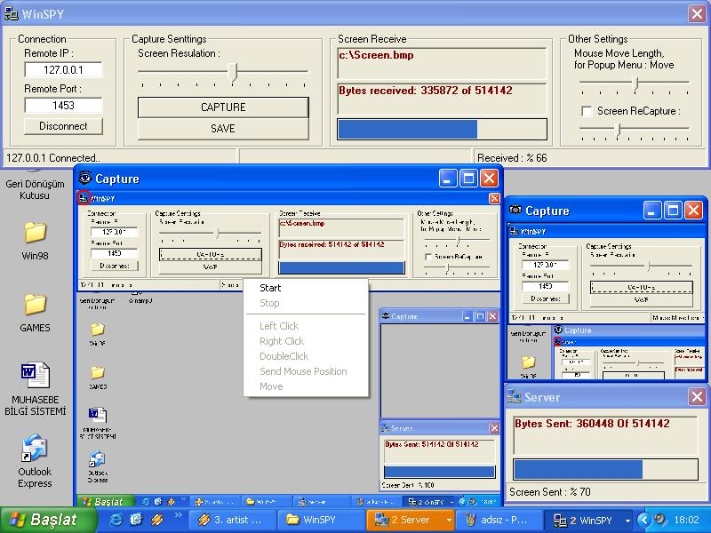



## WinSPY\(Professional Screen Control With Winsock\.\.\) \<\<\-\!\!DURMA YUKLE\!\!\-\>\>

### Description

Hi There!

Do you want to Control Screen from other computer with internet?

You must use WinSPY!! You can full screen control this program.

You can Full Mouse Control(Left Click, Right Click, Double Click, Send Mouse Position & Mouse Moving..)

And Adjust to Download Screen Resulation (%10~%100) & Screen ReCapture period (5~50 seconds).

This is my first zip submission, Please Vote Me!!
 
### More Info
 

             |
---                |---
**Submitted On**   |2003-07-02 15:34:36
**By**             |[Osman Gulercan](https://github.com/Planet-Source-Code/PSCIndex/blob/master/ByAuthor/osman-gulercan.md)
**Level**          |Advanced
**User Rating**    |4.3 (30 globes from 7 users)
**Compatibility**  |VB 6\.0
**Category**       |[Internet/ HTML](https://github.com/Planet-Source-Code/PSCIndex/blob/master/ByCategory/internet-html__1-34.md)
**World**          |[Visual Basic](https://github.com/Planet-Source-Code/PSCIndex/blob/master/ByWorld/visual-basic.md)
**Archive File**   |[WinSPY\(Pro1630518162003\.zip](https://github.com/Planet-Source-Code/osman-gulercan-winspy-professional-screen-control-with-winsock-durma-yukle__1-47744/archive/master.zip)

